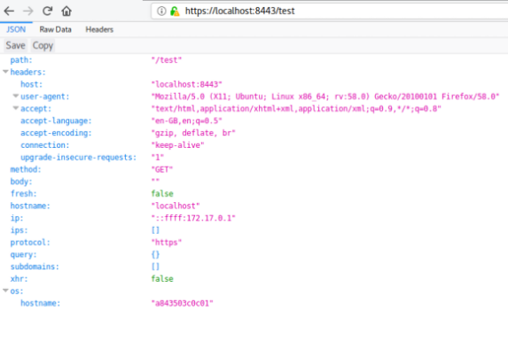

Docker image which echoes various HTTP request properties back to client, as well as in docker logs. 

## Sample output

## Usage

    docker run -p 8080:80 -p 8443:443 --rm -t mendhak/http-https-echo

Then issue a request via your browser or curl -

    curl -k -X PUT -H "Arbitrary:Header" -d aaa=bbb https://localhost:8443/hello-world

## In Docker Compose

## Building

    docker build -t mendhak/http-echo .

